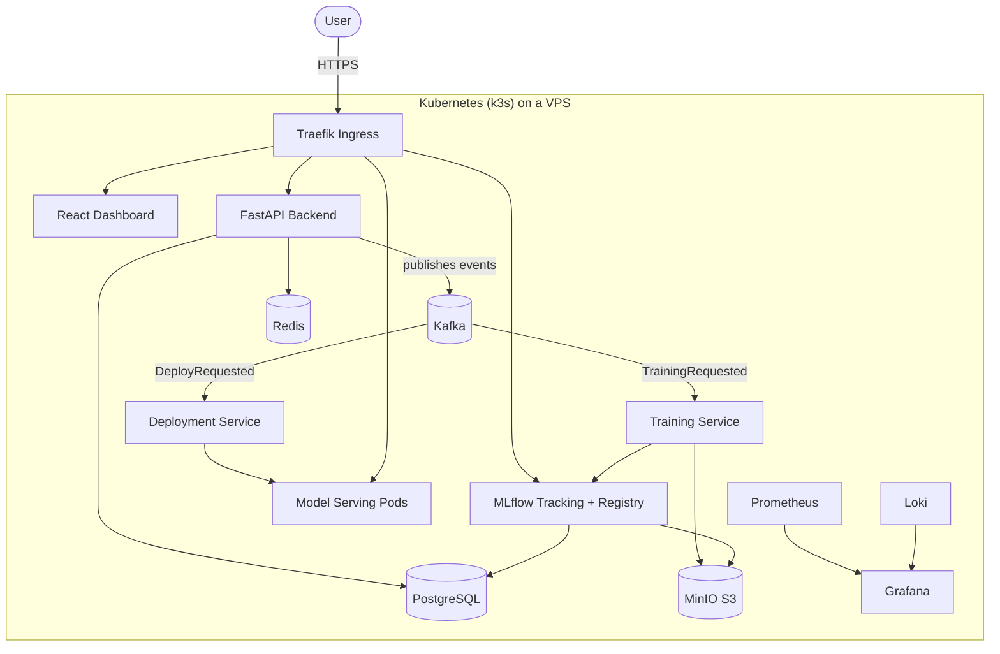

# Cloud ML Platform

[](https://github.com/malo-coet/cloud-ml-platform/actions/workflows/ci.yml)
[](LICENSE)
[](backend/pyproject.toml)
[](frontend/package.json)

A self-hosted MLOps platform that lets a team of data scientists **upload datasets, train models, track experiments and deploy models to production** — built from scratch on a single VPS with Kubernetes (k3s), an event-driven architecture and full observability.

> **Status: work in progress.** The platform is being built incrementally in sprints — see the [roadmap](docs/roadmap.md) for what is done and what is next.

## Why this project

Managed ML platforms (SageMaker, Vertex AI) hide the interesting parts. This project rebuilds the core of such a platform end to end — API, event bus, training workers, model registry, automated deployment, monitoring — to demonstrate system design, networking and DevOps skills, not just ML code.

## Architecture



Key design decisions (full rationale in [docs/tech-choices.md](docs/tech-choices.md)):

- **Event-driven core** — the API never trains a model itself; it publishes `TrainingRequested` / `DeployRequested` events to Kafka, consumed by dedicated microservices. Training load never blocks the API.
- **S3-compatible storage** — datasets and model artifacts live in MinIO, metadata in PostgreSQL.
- **Everything as code** — Docker Compose for local dev, Kubernetes manifests + Ansible + OpenTofu for the VPS, GitHub Actions for CI/CD.

## Tech stack

| Layer | Technology |
|---|---|
| Frontend | React 19, TypeScript, Vite |
| API | FastAPI, SQLAlchemy, Alembic, Pydantic |
| ML | PyTorch, scikit-learn, MLflow (tracking + model registry) |
| Messaging | Apache Kafka (KRaft mode) |
| Storage | PostgreSQL, Redis, MinIO (S3) |
| Orchestration | Kubernetes (k3s), Helm, Traefik, cert-manager |
| Observability | Prometheus, Grafana, Loki |
| Infrastructure | DigitalOcean VPS, Ansible, OpenTofu, GitHub Actions |

## Repository layout

```
cloud-ml-platform/
├── frontend/            # React dashboard
├── backend/             # FastAPI REST API
├── training-service/    # Kafka consumer that runs ML training jobs
├── deployment-service/  # Kafka consumer that deploys models to Kubernetes
├── infra/
│   ├── docker/          # Custom images (MLflow, Postgres init)
│   ├── kubernetes/      # k3s manifests
│   ├── ansible/         # VPS provisioning
│   └── opentofu/        # Cloud resources (droplet, DNS, firewall)
├── docs/                # Architecture, roadmap, tech choices
└── .github/             # CI/CD workflows
```

## Getting started (local)

Prerequisites: Docker Desktop (or Docker Engine + Compose v2).

```bash
git clone https://github.com/malo-coet/cloud-ml-platform.git
cd cloud-ml-platform
cp .env.example .env   # optional — sane defaults are built in
docker compose up -d --build
```

| Service | URL |
|---|---|
| Dashboard | http://localhost:5173 |
| API docs (Swagger) | http://localhost:8000/api/docs |
| MLflow UI | http://localhost:5001 |
| MinIO console | http://localhost:9001 |
| Adminer (database UI) | http://localhost:8080 |

> macOS note: MLflow is exposed on port **5001** because macOS reserves port 5000 for AirPlay Receiver.

Stop everything with `docker compose down` (add `-v` to also wipe data volumes).

## Documentation

- [Architecture](docs/architecture.md) — components, data flows, event catalogue
- [Deployment](docs/deployment.md) — provisioning a VPS and running on k3s
- [Roadmap](docs/roadmap.md) — sprint-by-sprint plan and progress
- [Tech choices](docs/tech-choices.md) — why each technology was picked

## License

[MIT](LICENSE)
