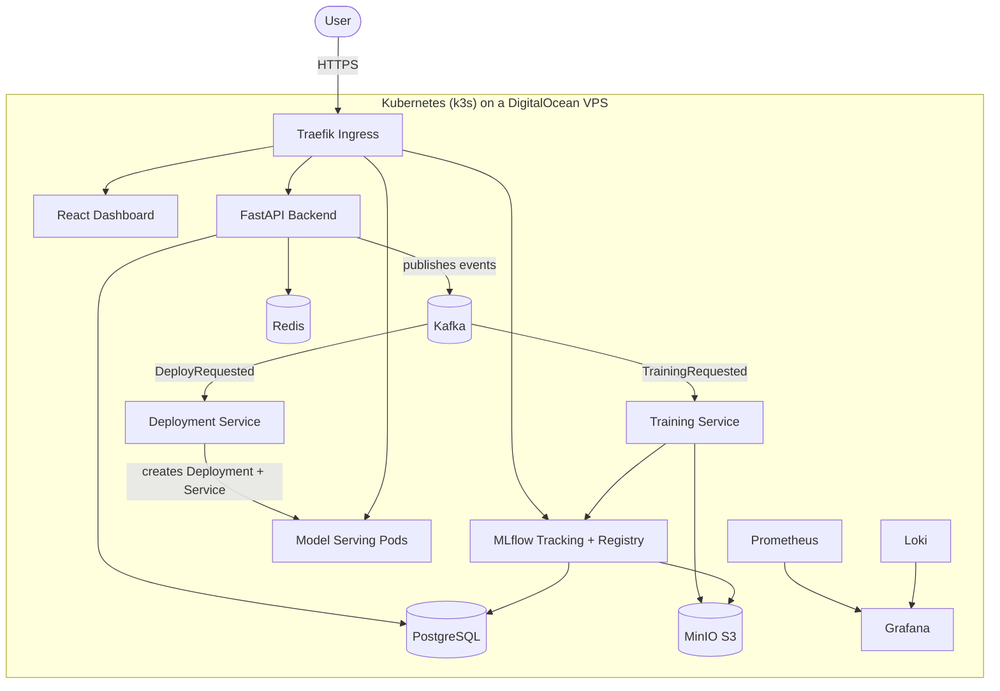
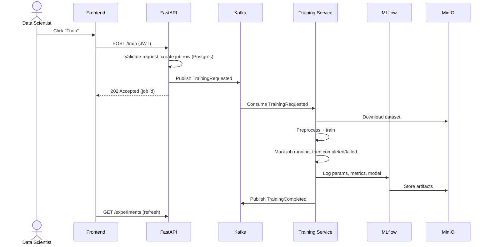

# Architecture

This document describes the target architecture of the platform and how data flows through it. For the reasoning behind each technology, see [tech-choices.md](tech-choices.md).

## System overview

## Components

| Component | Role |
|---|---|
| **React frontend** | Dashboard: login, datasets, experiments, models, deployments, monitoring. |
| **FastAPI backend** | REST API and single entry point for business logic: auth (JWT), dataset management, experiment listing. Publishes events to Kafka — it never runs heavy work itself. |
| **Training Service** | Kafka consumer. On `TrainingRequested`: fetches the dataset from MinIO, preprocesses, trains (PyTorch / scikit-learn), logs params/metrics/artifacts to MLflow. |
| **Deployment Service** | Kafka consumer. On `DeployRequested`: pulls the model from the MLflow registry, builds a serving image, creates the Kubernetes Deployment/Service, exposes a prediction endpoint through Traefik. |
| **PostgreSQL** | Source of truth for users, dataset metadata, training jobs. Also the MLflow backend store (separate `mlflow` database). |
| **Redis** | Cache and short-lived state (sessions, rate limiting, job status). |
| **Kafka** | Event bus decoupling the API from the workers. Single-node KRaft mode (no ZooKeeper). |
| **MinIO** | S3-compatible object storage: raw datasets (`datasets` bucket) and MLflow artifacts (`mlflow-artifacts` bucket). |
| **MLflow** | Experiment tracking and Model Registry (staging/production promotion drives automated deployment). |
| **Traefik** | Ingress controller: routing per subdomain, TLS termination (Let's Encrypt via cert-manager). |
| **Prometheus / Grafana / Loki** | Metrics, dashboards and centralized logs. |

## Event-driven training flow

The API stays fast because anything heavy is delegated through Kafka:

### Event catalogue

| Topic | Producer | Consumer | Payload (summary) | Status |
|---|---|---|---|---|
| `training.requested` | Backend | Training Service | job id, dataset id, model type | ✅ implemented |
| `training.completed` | Training Service | (future: notifier) | job id, status, MLflow run id, error | ✅ implemented |
| `training.requested.dlq` | Training Service | — (manual inspection) | original poison message | ✅ implemented |
| `deploy.requested` | Backend | Deployment Service | model name, version, target stage | planned (Sprint 7) |
| `model.deployed` | Deployment Service | Backend | model name, version, endpoint URL | planned (Sprint 7) |

The training service both updates the job row (it owns job execution) and emits
`training.completed` for downstream consumers. Consumer groups guarantee each
event is processed once; redelivered events are skipped idempotently, and
messages that can never be processed (malformed, unknown job) go to the
dead-letter topic.

## Storage layout

- **PostgreSQL `mlplatform`** — application schema (users, datasets, jobs), managed with SQLAlchemy + Alembic migrations.
- **PostgreSQL `mlflow`** — MLflow backend store (runs, params, metrics, registry). Created automatically by an init script in local dev.
- **MinIO `datasets`** — user-uploaded files (CSV, images, ZIP, Parquet), keyed by owner and version.
- **MinIO `mlflow-artifacts`** — models and artifacts, written by the MLflow server (`--serve-artifacts` proxy mode, so clients never need MinIO credentials).

## Environments

| | Local dev | Production |
|---|---|---|
| Orchestrator | Docker Compose | k3s on a DigitalOcean droplet |
| Ingress / TLS | none (localhost ports) | Traefik + cert-manager (Let's Encrypt) |
| Config | `.env` + compose defaults | Kubernetes Secrets + ConfigMaps |
| Images | built locally | pulled from GitHub Container Registry (GHCR) |
| Deploy | `docker compose up` | GitHub Actions → GHCR → k3s |

### Public URL scheme (production)

All services are exposed under `mlops.mcoet.com` sub-domains, routed by Traefik:

| URL | Service |
|---|---|
| `mlops.mcoet.com` | Dashboard |
| `api.mlops.mcoet.com` | FastAPI |
| `mlflow.mlops.mcoet.com` | MLflow UI |
| `grafana.mlops.mcoet.com` | Grafana |
| `minio.mlops.mcoet.com` | MinIO console |
| `predict.mlops.mcoet.com` | Deployed model endpoints |
